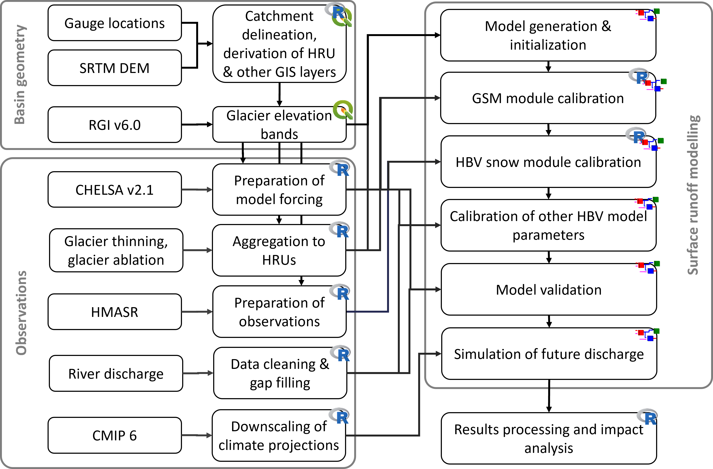

<!-- README.md is generated from README.Rmd. Please edit that file -->

```{r, include = FALSE}
knitr::opts_chunk$set(
  collapse = TRUE,
  comment = "#>",
  fig.path = "man/figures/README-",
  out.width = "100%"
)
```

# riversCentralAsia

## Summary

The R package riversCentralAsia includes a set of tools to facilitate and automate data preparation for hydrological modelling. It thus contributes to more reproducible modeling workflows and makes hydrological modeling more accessible to students and to interested professional modelers. 

The package has been developed within the frame of a master level course
on applied hydrological modelling in Central Asia and is extensively
used in the open-source book
<a href="https://hydrosolutions.github.io/caham_book/"
target="_blank">Modeling of Hydrological Systems in Semi-Arid Central
Asia</a> (Siegfried & Marti, 2022). The workflows are further validated within the
Horizon 2020 project
<a href="https://hydro4u.eu/" target="_blank">HYDRO4U</a>.

While the package has been developed for the Central Asia region, most
of the functions are generic and can be used for modelling projects
anywhere in the world.

The most important functionalities of the package as well as the raw
data that can be processed with the package are described in the the
articles of the
<a href="https://hydrosolutions.github.io/riversCentralAsia/"
target="_blank">project documentation site</a> but the examples in the
book <a href="https://hydrosolutions.github.io/caham_book/"
target="_blank">Modeling of Hydrological Systems in Semi-Arid Central
Asia</a> demonstrate the full range of functions available and how to
use them in a workflow.

## Statement of need

Data preparation comes before hydrological modelling and is actually one
of the biggest work chunks in the modelling process. This package
includes a number of helper functions that can be connected to efficient
workflows that automatize the data preparation process for hydrological
modelling as shown in the figure below. 

```{r out.width='80%', echo=FALSE}

```
  
Figure: Overview over the modelling workflow supported by the riversCentralAsia package (Image source: Marti et al., 2022). Abbreviations are explained below. The workflow relies entirely on free, publicly available data and software.    

The data preparation step includes the delineation of river catchment boundaries and the derivation of hydrological response units (HRU) using gauge locations, the [SRTM digital elevation model (DEM)](https://doi.org/10.5067/MEaSUREs/SRTM/SRTMGL1.003){target="_blank"} and glacier outlines from the [Randolph Glacier Inventory (RGI)](https://doi.org/10.7265/N5-RGI-60){target="_blank"}.

Although the High Mountain region of Central Asia is generally perceived as a data scarce region, a number of gridded data products are available that form a fair basis for regional hydrological modelling at seasonal time scales. [CHELSA v2.1](https://chelsa-climate.org/){target="_blank"} is a weather data product at 1 km2 by 1km2 resolution. [Glacier thinning](https://www.nature.com/articles/s41586-021-03436-z){target="_blank"} and [glacier ablation](https://doi.org/10.1038/s41467-021-23073-4){target="_blank"} are data sets from open-access literature. Data on snow water equivalents is sourced from the [High Mountain Asia Snow Reanalysis (HMASR) Product](https://doi.org/10.5067/HNAUGJQXSCVU){target="_blank"}, river discharge is taken from the hydrological year books of the HydroMeteorological Institutes in Central Asia, and [CMIP6 climate model results area available from Copernicus](https://cds.climate.copernicus.eu/cdsapp#!/dataset/projections-cmip6?tab=form){target="_blank"}. 

Hydrological modelling is done using the free hydrologic-hydraulic modelling software
<a href="https://crealp.ch/rs-minerve/" target="_blank">RS Minerve</a>. Some alternative geoprocessing workflows are described in [QGIS](https://www.qgis.org/en/site/){target="_blank"}. 

The riversCentralAsia package functionality includes:

-   Efficient processing of present and future climate forcing,
    including hydro-meterological data from Central Asia (<a
    href="https://hydrosolutions.github.io/riversCentralAsia/articles/01-discharge-processing-examples.html"
    target="_blank">time series</a> and re-analysis data) and
    down-scaling of ERA5 re-analysis data (a more advanced topic which
    is described in the
    <a href="https://hydrosolutions.github.io/caham_book/climate_data.html"
    target="_blank">course book</a>)

-   The <a
    href="https://hydrosolutions.github.io/riversCentralAsia/articles/02-preparation-of-climate-forcing.html"
    target="_blank">preparation of GIS layers for automated model
    generation</a> and chapter <a
    href="https://hydrosolutions.github.io/caham_book/geospatial_data.html"
    target="_blank">Geospatial data</a> in the course book

-   <a
    href="https://hydrosolutions.github.io/riversCentralAsia/articles/04-glacier-functions.html"
    target="_blank">Volume area scaling of glaciers</a>

-   Post-processing of simulation results, e.g. <a
    href="https://hydrosolutions.github.io/riversCentralAsia/articles/05-snow-calibration.html"
    target="_blank">extraction and visualisation of snow water
    equivalent</a> or <a
    href="https://hydrosolutions.github.io/riversCentralAsia/reference/computeAnnualFlowDurationCurve.html"
    target="_blank">computation of flow duration curves</a>

-   I/O interface with the hydrologic-hydraulic modelling software that allows reading and writing of input and output files of the hydraulic-hydrological modelling software <a href="https://crealp.ch/rs-minerve/" target="_blank">RS Minerve</a>.

While here, we focus on the description of the individual functions, the
strengths of the package comes to play mostly when the functions are
connected to automatize the data preparation process. These workflows
are extensively documented in the book
<a href="https://hydrosolutions.github.io/caham_book/"
target="_blank">Modeling of Hydrological Systems in Semi-Arid Central
Asia</a>.

Currently, a relatively complete dataset of the Chirchik River Basin
with decadal and monthly data on discharge, precipitation and
temperature is included.

## Related packages

The hydraulic-hydrological modelling software RS MINERVE can be accessed through Common Language Runtime (CLR) directly from within R, thus the use of the RS MINERVE GUI can be avoided and multiple runs of large models can be speed up. The [github repository RSMinerveR](https://github.com/hydrosolutions/RSMinerveR){target="_blank"} includes examples of how to use CLR commands to use the Visual Basic interface with RS MINERVE documented in the [technical manual](https://crealp.github.io/rsminerve-releases/tech_scripts.html){target="_blank}. This functionality is recommended for advanced users of RS MINERVE only. 

## Installation

The package has many dependencies which will be installed alongside
riversCentralAsia. To successfully install the package you need prior
installations of the following packages: rlang, magrittr, stringr and
purrr. Should the installation fail, test if you have the following
dependencies installed.

``` r
find.package(c("rlang", "magrittr", "stringr", "purrr"))
```

If they are not yet available on your system, please install them using
the following commands.

``` r
install.packages(c("rlang", "magrittr", "stringr", "purrr"))
```

All other dependencies are installed automatically. 

**Note** that **Mac** users may have to install the binary version of 
the dependency package exactextractr manually (not the more recent
source version). 

**Note** that **Windows** users require a working installation of
<a href="https://cran.r-project.org/bin/windows/Rtools/"
target="_blank">RTools</a> to install packages from github.

You can install the development version from
<a href="https://github.com/hydrosolutions/riversCentralAsia/"
target="_blank">GitHub</a> with:

``` r
# install.packages("devtools")
devtools::install_github("hydrosolutions/riversCentralAsia")
library(riversCentralAsia)
```

We recommend testing of the riversCentralAsia package before using it to
make sure all dependencies integrate with the riversCentralAsia package
as they should. The following step-by-step instructions explain how to
do this:

1.  Go to the [packages github
    repository](https://github.com/hydrosolutions/riversCentralAsia),
    click the green code button and select download zip. This will
    download a zip folder with the package code to your Download
    folder.  
2.  Extract the package files to a location of your preference. More
    detailed instructions for this step: right-click on the zip folder
    and select “extract all”in the pop-up window. Select a location to
    extract the files to and wait for the process to finish.  
3.  Navigate into the riversCentralAsia folder to in which the freshly
    downloaded package data is stored and open the riversCentralAsia R
    project file. This will open the project in your R GUI.  
4.  In the R console, type `devtools::test()` and hit enter. The tests
    will run for about a minute. If the test return
    `[ FAIL 0 | WARN 0 | SKIP 0 | PASS 86 ]` at the end, all test were
    successful and the package will run without problems on your system.
    Should one of the tests fail, please make sure all the package
    dependencies are up to date. If the problem persists, please file an
    [issue](https://github.com/hydrosolutions/riversCentralAsia/issues)
    including the error message you get so we can look at the problem
    and hopefully solve it.  
5.  If you don’t need the source codes any more, you can safely delete
    the zip file and the folder with the extracted riversCentralAsia
    files.

## Community guidelines

Please consult the documentation and the examples provided in the
<a href="https://hydrosolutions.github.io/riversCentralAsia/index.html"
target="_blank">package documentation</a> and in the open-source course
book <a href="https://hydrosolutions.github.io/caham_book/"
target="_blank">Modeling of Hydrological Systems in Semi-Arid Central
Asia</a>.

For problems using the functions of for suggestions, please use the
<a href="https://github.com/hydrosolutions/riversCentralAsia/issues"
target="_blank">issue tool</a>.

## How to cite

Please cite the package as:

Tobias Siegfried, & Beatrice Marti (2021): riversCentralAsia
<version number>. <https://doi.org/10.5281/zenodo.4667422>

[](https://doi.org/10.5281/zenodo.4667422)

## Examples

This is a basic example which shows you how to visualize some of the
included data.

``` r
library(riversCentralAsia)
library(tidyverse)
library(timetk)

# Loading and visualising discharge data
ChirchikRiverBasin  # load data
ChirchikRiverBasin |> 
  # Filter for the data type, here discharge "Q"
  dplyr::filter(type == "Q") |> 
  drop_na() |> 
  group_by(river) |> 
  plot_time_series(
    date,
    data,
    .interactive = FALSE,
    .facet_ncol = 2,
    .smooth = FALSE, 
    .y_lab = "Discharge [m3/s]", 
    .x_lab = "Year", 
    .title = "Discharge time series in the ChirchikRiverBasin data set"
    )
```

## Mentions

The package is used extensively in the course book
<a href="https://hydrosolutions.github.io/caham_book/"
target="_blank">Modeling of Hydrological Systems in Semi-Arid Central
Asia</a> (Siegfried & Marti, 2022).

The workflows presented in the course book, using the riversCentralAsia
package, are further validated within the Horizon 2020 project
<a href="https://hydro4u.eu/" target="_blank">HYDRO4U</a> where future
small hydro power potential is evaluated using hydrological modelling.

For R & RS MINERVE users, the package
<a href="https://github.com/hydrosolutions/RSMinerveR"
target="_blank">RSMinverveR</a> is recommended which allows the
interfacing between R and RS Minerve (with examples based on the Visual
Basic Script examples by CREALP).

## Acknowledgement

The preparation of the course book and thus the preparation of the
package was financially supported by the Swiss Agency for Development
and Cooperation, the German Kazakh University in Almaty and
hydrosolutions.

This R package was submitted to the Journal of Open Source Software. We
thank @tonyewong and @mengqi-z for their valuable inputs during the
review of the package and @crvernon for their editing work.

## References

Tobias Siegfried & Beatrice Marti (2022): Modeling of Hydrological Systems in Semi-Arid Central Asia (<a href="https://hydrosolutions.github.io/caham_book/" target="_blank">https://hydrosolutions.github.io/caham_book/</a>). DOI: 10.5281/zenodo.6350042

Marti, B. S., Zhumabaev, A., and Siegfried, T.: A comprehensive open-source 
course for teaching applied hydrological modelling in Central Asia, 
EGUsphere [preprint], <a href="https://doi.org/10.5194/egusphere-2022-966" target="_blank">https://doi.org/10.5194/egusphere-2022-966</a>, 2022.
