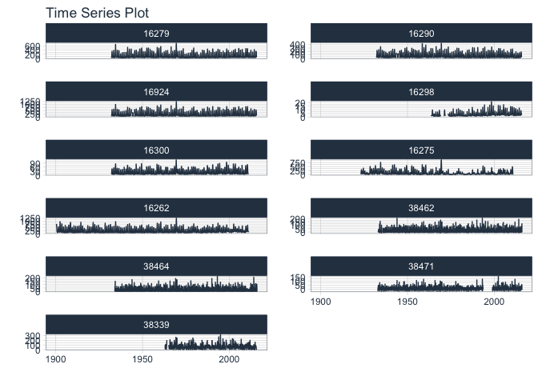

<!-- README.md is generated from README.Rmd. Please edit that file -->

# riversCentralAsia

<!-- badges: start -->
<!-- badges: end -->

The goal of riversCentralAsia is to …

## Installation

You can install the released version of riversCentralAsia from
[CRAN](https://CRAN.R-project.org) with:

``` r
install.packages("riversCentralAsia")
```

And the development version from [GitHub](https://github.com/) with:

``` r
# install.packages("devtools")
devtools::install_github("hydrosolutions/riversCentralAsia")
```

## Example

This is a basic example which shows you how to solve a common problem:

``` r
library(riversCentralAsia)
library(tidyverse)
#> ── Attaching packages ─────────────────────────────────────── tidyverse 1.3.0 ──
#> ✓ ggplot2 3.3.2     ✓ purrr   0.3.4
#> ✓ tibble  3.0.4     ✓ dplyr   1.0.2
#> ✓ tidyr   1.1.2     ✓ stringr 1.4.0
#> ✓ readr   1.4.0     ✓ forcats 0.5.0
#> ── Conflicts ────────────────────────────────────────── tidyverse_conflicts() ──
#> x dplyr::filter() masks stats::filter()
#> x dplyr::lag()    masks stats::lag()
library(timetk)
## basic example code
ChirchikRiverBasin # load data
#> # A tibble: 29,892 x 18
#>    date        data  norm units type  code  station river basin resolution
#>    <date>     <dbl> <dbl> <chr> <fct> <chr> <chr>   <chr> <chr> <fct>     
#>  1 1932-01-10  48.8  38.8 m3s   Q     16279 Khuday… Chat… Chir… dec       
#>  2 1932-01-20  48.4  37.5 m3s   Q     16279 Khuday… Chat… Chir… dec       
#>  3 1932-01-31  42.4  36.6 m3s   Q     16279 Khuday… Chat… Chir… dec       
#>  4 1932-02-10  43.7  36.4 m3s   Q     16279 Khuday… Chat… Chir… dec       
#>  5 1932-02-20  44.2  36.3 m3s   Q     16279 Khuday… Chat… Chir… dec       
#>  6 1932-02-29  47.7  36.9 m3s   Q     16279 Khuday… Chat… Chir… dec       
#>  7 1932-03-10  54.1  39.4 m3s   Q     16279 Khuday… Chat… Chir… dec       
#>  8 1932-03-20  63.2  47.6 m3s   Q     16279 Khuday… Chat… Chir… dec       
#>  9 1932-03-31 103    60.5 m3s   Q     16279 Khuday… Chat… Chir… dec       
#> 10 1932-04-10 103    86.4 m3s   Q     16279 Khuday… Chat… Chir… dec       
#> # … with 29,882 more rows, and 8 more variables: lon_UTM42.x <dbl>,
#> #   lat_UTM42.x <dbl>, altitude_masl.x <dbl>, basinSize_sqkm.x <dbl>,
#> #   lon_UTM42.y <dbl>, lat_UTM42.y <dbl>, altitude_masl.y <dbl>,
#> #   basinSize_sqkm.y <dbl>
ChirchikRiverBasin %>% group_by(code) %>% plot_time_series(date,data,.interactive = FALSE,.facet_ncol = 2,.smooth = FALSE)
#> Warning: Removed 3 row(s) containing missing values (geom_path).
```


