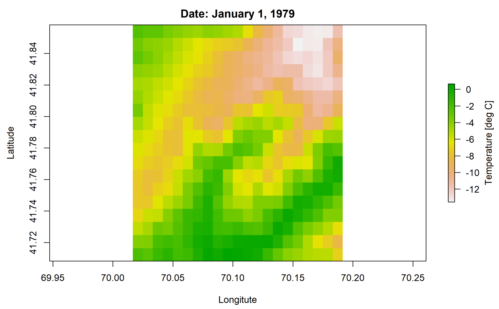
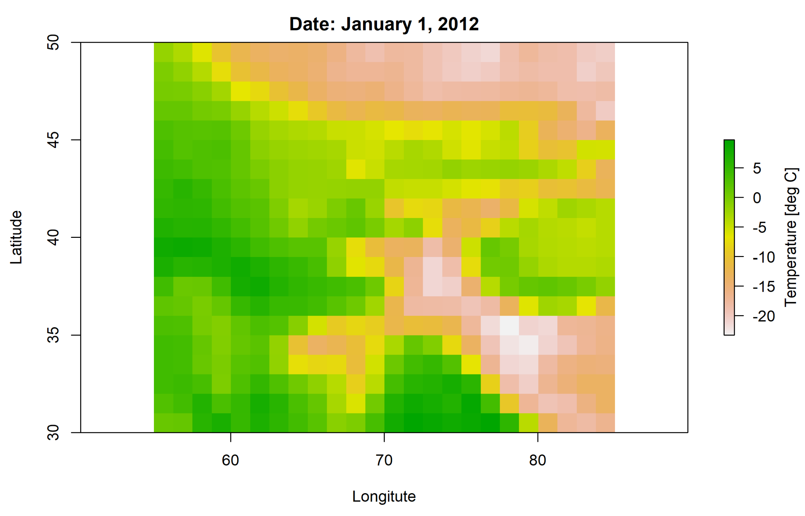

```{r, include = FALSE}
knitr::opts_chunk$set(
  collapse = TRUE,
  comment = "#>"
)
knitr::opts_knit$set(
  rmarkdown.html_vignette.check_title = FALSE
)
```

The package riversCentralAsia can read several types of raw data from time series in csv files to nc files, all of which are described in more detail below. 

```{r, echo=FALSE, message=FALSE, error=FALSE, warning=FALSE}
library(tidyverse)
library(lubridate)
library(timetk)
library(riversCentralAsia)
```

## Time series
In the former Soviet republics, river discharge but also climate variables like temperature and precipitation are often available from hydrological yearbooks published by the national HydroMeteorological institutes. The common data format for these time series has years in rows and months or decade (10-day interval) per year in columns as indicated in the two examples below. 

```{r, echo=FALSE}
knitr::kable(
  tibble::tribble(
  ~Year, ~Jan, ~Feb, ~Mar, ~..., ~Nov, ~Dec,   
 "2001","0.1","0.1","...",  " ","...","0.2",  
 "2001","0.1","0.2","...",  " ",  " ","...",
 "2003","0.2","...",  " ",  " ",  " ",  " ",
  "...","...",  " ",  " ",  " ",  " ",  " "), 
 align = "c", format = "pipe", padding = 3, 
 caption = "Example for monthly data format.")
``` 
or    
   
```{r, echo=FALSE}
knitr::kable(
  tibble::tribble(
  ~Year, ~Jan, ~Jan, ~Jan, ~Feb, ~Feb, ~Feb, ~Mar, ~..., ~Dec, ~Dec,   
    " ",  "I", "II","III",  "I", "II","III",  "I","...", "II","III",   
 "2001","0.1","0.1","...",  " ",  " ",  " ",  " ",  " ","...","0.2",  
 "2001","0.1","0.2","...",  " ",  " ",  " ",  " ",  " ",  " ","...",
 "2003","0.2","...",  " ",  " ",  " ",  " ",  " ",  " ",  " ",  " ",
  "...","...",  " ",  " ",  " ",  " ",  " ",  " ",  " ",  " ",  " "), 
 align = "c", format = "pipe", padding = 2, 
 caption = "Example for decadal data format.")
```

   
To load the time series data using the function `loadTabularData`, save the cells without the headers in a csv file. We recommend commas as field separators and points as decimal separators.   

A valid csv file example for monthly time series data is given below.   
     
      
1990,0.1,0.2,0.3,0.4,0.5,0.6,0.7,0.8,0.9,1,1.1,1.2    
1991,0.1,0.2,0.3,0.4,0.5,0.6,0.7,0.8,0.9,1,1.1,1.2    
1992,0.1,0.2,0.3,0.4,0.5,0.6,0.7,0.8,0.9,1,1.1,1.2    
    
    
In the [article with the discharge processing example](https://hydrosolutions.github.io/riversCentralAsia/articles/01-discharge-processing-examples.html) we show how you can load a csv file and how to produce various visualizations using the riversCentralAsia package (and it's numerous dependencies).  

## Climate raster data
Due to the limited amount of monitoring locations in Central Asia, the use of re-analysis climate data has it's distinct advantages. Of course, station data is still highly relevant to validate the re-analysis data and, if necessary, for correcting potential biases in the re-analysis data. The chapter [Climate data](https://hydrosolutions.github.io/caham_book/climate_data.html){target="_blank"} in the hydrological modelling course book has a very detailed description of the use of re-analysis data for hydrological modelling in Central Asia. Here we will refrain to the technical description of the data formats that can be processed with the riversCentralAsia package. 

### CHELSA
CHELSA v2.1 data [@karger_climatologies_2017, @karger_high-resolution_2020, @karger_global_2021] was provided to us by D. Karger as annual .nc (NetCDF) files with daily temperature or precipitation for the Central Asian region. You can access the CHELSA data via the website [https://chelsa-climate.org/](https://chelsa-climate.org/){target="_blank"}. 

NetCDF files can be quite large so it is often more convenient to use different software from R to inspect them and/or to crop them to your area of interest. For quick inspection of NetCDF files we recommend the free GUI [Panoply](https://www.giss.nasa.gov/tools/panoply/){target="_blank"} [@panoply_development_team_panoply_2022]. Cropping of NetCDF can be very conveniently done using the command line tool [CDO](https://code.mpimet.mpg.de/projects/cdo){target="_blank"} [@manager_luis_kornblueh_ralf_mueller_uwe_schu_cdo_2022]. CDO only works on Unix-type systems like Ubuntu and other Linux distributions or MacOS. Fortunately, you can also [activate Ubuntu on Windows OS](https://ubuntu.com/tutorials/install-ubuntu-on-wsl2-on-windows-11-with-gui-support#1-overview){target="_blank"} (10 or newer). The [CDO FAQ](https://code.mpimet.mpg.de/projects/cdo/wiki/FAQ){target="_blank"} lead you quickly to the commands to inspect a NetCDF file or to crop it to a region of interest.   

The CHELSA v2.1 NetCDF files are in the WGS84 projection with EPSG:4326. Please refer to the documentation of the data set you download. Ours includes daily precipitation sums in mm (varname = pr) or daily average near surface temperature in deg C (varname = tas) for each day of the year. There is one nc file for each year and for each climate variable. The date is included in the names of the daily images in the format X%Y.%m.%d (see example below).  

To reproduce the examples below, please download the file [test_gen_HRU_Climate_CSV_RSMinerve_input_file.nc](https://github.com/hydrosolutions/riversCentralAsia/blob/master/tests/testthat/test_gen_HRU_Climate_CSV_RSMinerve_input_file.nc){target="_blank"} from the test folder in the riversCentralAsia package on github. 

```{r, eval=FALSE}
library(raster)
library(riversCentralAsia)

# Adapt the path to the nc file
ncfilepath = "tests/testthat/test_gen_HRU_Climate_CSV_RSMinerve_input_file.nc"

# Read in the nc file as raster brick
chelsa_temperature_data <- raster::brick(ncfilepath)

# Inspect the brick: 
chelsa_temperature_data
#> class      : RasterBrick 
#> dimensions : 18, 21, 378, 365  (nrow, ncol, ncell, nlayers)
#> resolution : 0.008333333, 0.008333333  (x, y)
#> extent     : 70.01653, 70.19153, 41.70819, 41.85819  (xmin, xmax, ymin, ymax)
#> crs        : +proj=longlat +datum=WGS84 +no_defs 
#> source     : test_gen_HRU_Climate_CSV_RSMinerve_input_file.nc 
#> names      : X1979.01.01, X1979.01.02, X1979.01.03, X1979.01.04, X1979.01.05, X1979.01.06, #> X1979.01.07, X1979.01.08, X1979.01.09, X1979.01.10, X1979.01.11, X1979.01.12, X1979.01.13, #> X1979.01.14, X1979.01.15, ... 
#> Date       : 1979-01-01, 1979-12-31 (min, max)
#> varname    : tas 
```

The file contains one raster image of daily mean temperatures (please read the [technical documentation of the CHELSA v2.1 data](https://chelsa-climate.org/){target="_blank"} before using it). You can plot the temperature raster of January 1, 1979:  

```{r, eval=FALSE}
plot(chelsa_temperature_data$X1979.01.01, 
     xlab = "Longitute", ylab = "Latitude", main = "Date: January 1, 1979",
     legend.args = list(text = "Temperature [deg C]", side=4, line=2.5))
```


{width="90%"}


### Climate projections
The use of climate projection data for hydrological modelling is described in detail in the [respective chapter](https://hydrosolutions.github.io/caham_book/climate_data.html#sec-climate-projections){target="_blank"} of the online course book. As mentioned in the course book, pre-processing of the climate projection data is not a beginners level task and requires a working knowledge of cdo (or a similar NetCDF processing tool) because the outputs of the climate models are not consistent with each other (e.g. treatment of leap years, date handling and formats, units, projections, etc.). The data package of the course book includes future projections of climate variables compatible with the model selection used for impact assessments carried out in phase 3a of the Inter-Sectoral Impact Model Intercomparison Project (ISIMIP3b) [@ISIMIP3]. The package riversCentralAsia can process harmonized climate projection data, i.e. the raw climate projections are edited to have consistent dates, units and projections. The format of the nc files is the almost same as for the CHELSA v2.1 nc files described above. The only difference is in the layers names which include minutes and seconds for the climate projection files. This does, however, not make a difference in the riversCentralAsia package.

Should you wish to download projections from further climate models, you can download the climate projection data for the CMIP 6 phase from the [Copernicus data repository app](https://cds.climate.copernicus.eu/cdsapp#!/dataset/projections-cmip6?tab=form){target="_blank"}. It is then recommended to inspect the downloaded data for any obvious problems using panoply and to reformat the data to a riversCentralAsia-package-readable format using cdo or R (or any other scripting language of your choosing). 

To reproduce the example below, please download the [example nc file](https://www.dropbox.com/s/aw3mwh0ysydgu9j/tas_day_GFDL-ESM4_ssp126_r1i1p1f1_gr1.nc?dl=0){target="_blank"} from the data repository of the course book. It contains daily temperatures of the general circulation model (GCM) GFDL-ESM4 for the shared socio-economic scenario (SSP) 1 -2.6. Please refer to the [course book](https://hydrosolutions.github.io/caham_book/climate_data.html#sec-climate-projections){target="_blank"} for a more detailed explanation of GCMs and SSPs. 

```{r, eval=FALSE}
# Adapt the path to the nc file
ncfilepath = "C:../../../caham_data/central_asia_domain/climate/fut_sim/tas_day_GFDL-ESM4_ssp126_r1i1p1f1_gr1.nc"

# Read in the nc file as raster brick
GFDESM4_SSP126_temperature_data <- raster::brick(ncfilepath)

# Inspect the brick: 
GFDESM4_SSP126_temperature_data
#> class      : RasterBrick 
#> dimensions : 20, 24, 480, 32506  (nrow, ncol, ncell, nlayers)
#> resolution : 1.25, 1  (x, y)
#> extent     : 55, 85, 30, 50  (xmin, xmax, ymin, ymax)
#> crs        : +proj=longlat +datum=WGS84 +no_defs 
#> source     : tas_day_GFDL-ESM4_ssp126_r1i1p1f1_gr1.nc 
#> names      : X2012.01.01.12.00.00, X2012.01.02.12.00.00, X2012.01.03.12.00.00, X2012.01.04.12.00.00, X2012.01.05.12.00.00, X2012.01.06.12.00.00, X2012.01.07.12.00.00, X2012.01.08.12.00.00, X2012.01.09.12.00.00, X2012.01.10.12.00.00, X2012.01.11.12.00.00, X2012.01.12.12.00.00, X2012.01.13.12.00.00, X2012.01.14.12.00.00, X2012.01.15.12.00.00, ... 
#> Date/time  : 2012-01-01 12:00:00, 2100-12-30 12:00:00 (min, max)
#> varname    : tas 
```

The file contains one raster image of daily mean temperatures (please refer to the course book chapter on [climate data](https://hydrosolutions.github.io/caham_book/climate_data.html){target="_blank"} for more details on how to use this data for hydrological modelling). You can plot the temperature raster of January 1, 2012:  

```{r, eval=FALSE}
plot(GFDESM4_SSP126_temperature_data$X2012.01.01.12.00.00, 
     xlab = "Longitute", ylab = "Latitude", main = "Date: January 1, 2012",
     legend.args = list(text = "Temperature [deg C]", side=4, line=2.5))
```

{width="90%"}


## References


