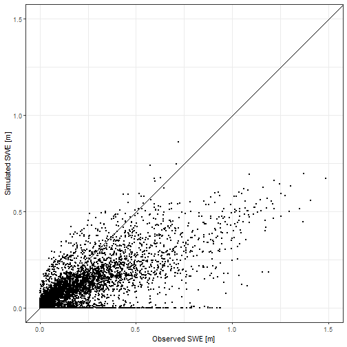
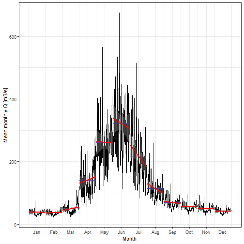
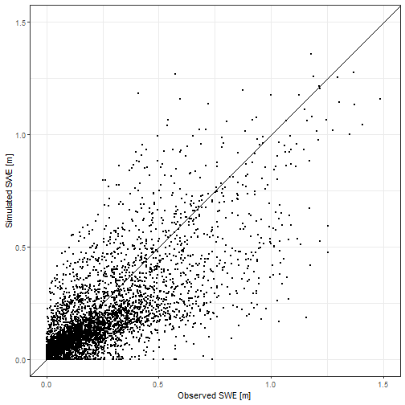
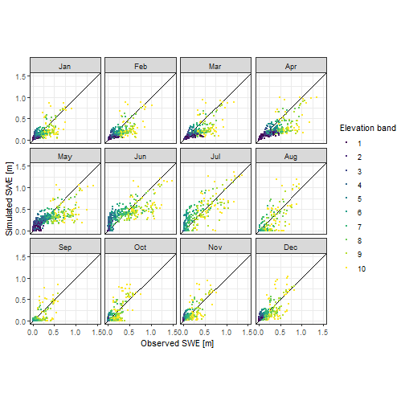

The pre-processing functions support the data loading and preparation of climate data input for hydrological modeling with RS Minerve. The following code snippets demonstrate how to load tabular discharge data and use some of the functions of riversCentralAsia to perform some basic discharge analysis. 

Here we only provide a quick overview. Please refer to the open-source book [Modeling of Hydrological Systems in Semi-Arid Central Asia](https://hydrosolutions.github.io/caham_book/){target="_blank"} for more details on how to use the riversCentralAsia package in hydrological modelling. 


Raw data (discharge, precipitation or temperature) in the tabular format. That is years in rows and months or decade per year in columns as below. 

Year Jan Feb Mar ... Nov Dec 
----------------------------
2001 0.1 0.1 ...     ... 0.2
2002 0.1 0.2 ...         ...
2003 0.2 ...
...  ...

or 

Year Jan Jan Jan Feb Feb Feb Mar ... Dec Dec 
      I   II III  I   II III  I       II III
--------------------------------------------
2001 0.1 0.1 ...                     ... 0.2
2002 0.1 0.2 ...                         ...
2003 0.2 ...
...  ...

Note that the function `loadTabularData` requires a csv file without the headers. 
To reproduce the below example, you need to download the demo data in the csv format from [here](https://www.dropbox.com/s/tccoxsp1qnpuozj/16076_Q.csv?dl=0). 


```r
discharge <- loadTabularData(
  fPath = "../../atbashy_glacier_demo_data/DISCHARGE/", 
  fName = "16076_Q.csv", 
  code = 16076, 
  stationName = "Unknown", 
  rName = "Atbashy", 
  rBasin = "Naryn", 
  dataType = "Q", 
  unit = "m3/s") |> 
  # The data is missing the last 3 months of 1995. We drop them here. 
  drop_na()
```

We use the `ChirchikRiverBasin` data included in the package. 

```r
discharge <- ChirchikRiverBasin |> 
  dplyr::filter(type == "Q", station == "Khudaydod", 
                year(date) < 2015 & year(date) > 1943)
```


The package `timetk` is a useful tool for time series analysis. The following two figures show examples of quick diagnostics plots that can be drawn with that package. 

```r
discharge %>% 
  plot_time_series(date,
    data,
    .smooth        = FALSE,
    .interactive   = TRUE,
    .title         = "",    
    .x_lab         = 'Year',
    .y_lab         = 'Mean monthly Q [m3/s]',
    .plotly_slider = TRUE)
```




```r
discharge |> 
  plot_seasonal_diagnostics(.date_var      = date,
                            .value         = data,
                            .title         = "",
                            .feature_set   = c("month.lbl"),
                            .interactive   = FALSE,
                            .x_lab         = "Year",
                            .y_lab         = "Mean monthly Q [m3/s]") +
  scale_x_discrete(breaks = c("January", "February", "March", "April", "May", 
                            "June", "July", "August", "September", "October", 
                            "November", "December", "1", "2", "3", "4"),
                   labels = c("J", "F", "M", "A", "M", "J", "J", "A", "S", "O", 
                              "N", "D","1", "2", "3", "4"))
```


```r
discharge %>% 
  summarise_by_time(.date_var = date, 
                    .by       = "month",
                    value     = mean(data)) %>% 
  tk_ts(frequency = 12) %>% 
  forecast::ggsubseriesplot(year.labels = FALSE) + 
              geom_smooth(method = "lm", color = "red", formula = y ~ x) +
              xlab('Month') +
              ylab('Mean monthly Q [m3/s]') + 
  theme_bw()
#> Registered S3 method overwritten by 'quantmod':
#>   method            from
#>   as.zoo.data.frame zoo
#> Warning: Non-numeric columns being dropped: date
```




For many applications, discharge data is processed within the hydrolgoical year. In Central Asia, the hydrological year starts on October 1 of the previous year and ends on September 30 of the current year. Hydrologists also differentiate between cold and warm season discharge. The following function calculates mean annual discharges (ann) as well as mean cold and warm season discharge (cs and ws respectively). 

```r
# Convert the decadal data to monthly data
discharge_monthly <- aggregate_to_monthly(
  dataTable = discharge, 
  funcTypeLib = list(mean = "Q"))

discharge_processed <- convert2HYY(
  data2convert = discharge_monthly, 
  stationCode = 16279,  
  typeSel = "Q")

discharge_processed |> pivot_longer(-hyYear) |>
  plot_time_series(hyYear,value,name,
                   .title = '',
                   .x_lab = 'Year',
                   .y_lab = 'Mean monthly Q [m3/s]',
                   .interactive = TRUE,
                   .smooth = FALSE)
```




```r
plotNormDevHYY(discharge_processed, "Q", "Discharge")
```




