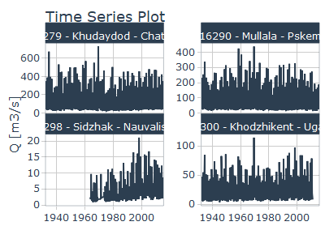

[RS Minerve](https://crealp.ch/rs-minerve/){target="_blank"} is a free to use hydrologic-hydraulic modelling software. It's accessibility makes is especially suitable for typical Hydromet tasks like flow forecasting. The package riversCentralAsia includes a number of functions to read and write files which interact with RS MINERVE. 
These tools are interesting for automated writing of forcing files and for reading post-processing and visualization of simulation results or model parameters. 

Using the package `RSMinerveR`, the software can be run from inside R. 

For details on model components and on file formates used in RS MINERVE please refer to the [RS MINERVE manuals](https://crealp.github.io/rsminerve-releases/){target="_blank"}. 

## Reading and writing parameters
The following RSMinerve objects are currently supported in the `riversCentralAsia` package:\
- Station\
- Source\
- SOCONT\
- Kinematic\
- Junction\
- GSM\
- HBV92\
- Comparator

The parameters for these objects are described in the [RS MINERVE User Manual](https://crealp.github.io/rsminerve-releases/){target="_blank"}. 

#### Example

To reproduce the example below, please download the file [Atbashy_PAR_postCal.txt](https://www.dropbox.com/s/y4r44h06jwdnsde/Atbaschy_PAR_postCal.txt?dl=0){target="_blank"} from the demo data folder available from dropbox. Should you want to test a wider number of RS MINERVE I/O functions, we recommend downloading the entire example data folder [here](https://www.dropbox.com/sh/r0lqggc77ka0uxd/AAChuIyLHHFIfAdgxNKiU2dpa?dl=0){target="_blank"}. 


```r
library(tidyverse)
library(lubridate)
library(riversCentralAsia)

# Download the file Atbashy_PAR_postCal.txt from https://www.dropbox.com/s/y4r44h06jwdnsde/Atbaschy_PAR_postCal.txt?dl=0

# Adapt the path below 
parameters_orig <- readRSMParameters("../../atbashy_glacier_demo_data/RSMINERVE/Atbaschy_PAR_postCal.txt") |> 
  dplyr::filter(Parameters == "Ku [1/d]") 

ggplot(parameters_orig) + 
  geom_col(aes(Zone, Values), position = "dodge") + 
  ylab(parameters_orig$Parameters[1]) + 
  theme_bw()
```


The following shows an example how the model parameters can be changed and written to a RS MINERVE-readable format. 


```r
# Doubble all Ku-values in zone A: 
parameters <- readRSMParameters(
  "../../atbashy_glacier_demo_data/RSMINERVE/Atbaschy_PAR_postCal.txt") |> 
  mutate(Values = ifelse(Parameters == "Ku [1/d]" & Zone == "A", Values * 2, 
                         Values))

comparison <- parameters_orig |> 
  mutate(Set = "Original") |> 
  add_row(parameters |> dplyr::filter(Parameters == "Ku [1/d]") |> 
            mutate(Set = "Modified"))

ggplot(comparison) + 
  geom_col(aes(Zone, Values, fill = Set), position = "dodge") + 
  scale_fill_viridis_d() + 
  ylab(parameters_orig$Parameters[1]) + 
  theme_bw()
```



```r

# Uncomment to write and adapt the output file path (second argument).
# writeRSMParameters(parameters, "Parameters_modified_Ku.txt")
```

## Reading simulation results

Another useful application for the RS MINERVE I/O functions is the reading of simulation results and the analysis of the partitioning of the total basin discharge into the individual fluxes. The code below illustrates how this may be done: 

### Writing a check node file
Writing a selection node file that can be imported to RS MINERVE where the selection can be used to export the selected simulation results. This is useful for large models with many model objects where it is cumbersome to manually toggle the desired results in RS MINERVE.

A check node file is written in the xml format (see [RS MINERVE documentation](https://crealp.github.io/rsminerve-releases/tech_file_formats.html#object-selection-files){target="_blank"}). You can have a look at an [example of a check node file in the demo data folder](https://www.dropbox.com/s/jz01m0ikrdl8h6h/FluxesAndStates.chk?dl=0){target="_blank"}. 

When I need to write a specific check node file, I typically ask RS MINERVE to write an example file for me (by selecting a few examples of variables I want to export) and then write the check node file in R by adapting the example below. 


```r
# In this example, we want to export all fluxes and some states from all 
# hydrological response units (HRU) in our hydrological model from RS MINERVE. 
#
# Make sure you have the example shape file with the hydrological response units 
# used for hydrological modelling in RS MINERVE (16076_HRU.shp) downloaded from 
# the example data set 
# https://www.dropbox.com/s/ob5xrbp2ynfxzn3/16076_HRU.shp?dl=0

# Adapt the path below
# This reads in the names of the HRUs 
Object_IDs <- sf::st_read("../../atbashy_glacier_demo_data/GIS/16076_HRU.shp") |> 
  sf::st_drop_geometry()
  

# Write check node file
hbv_var_list <- c("Qr (m3/s)", "Qu (m3/s)", "Ql (m3/s)", "SWE (m)", "HUM (m)", 
                  "SU (m)", "SL (m)", "Peq (m/s)")
station_var_list <- c("P (m/s)")

data <- tibble(
  Model = rep("Model Atbaschy", 
              length(Object_IDs$name)*length(hbv_var_list) + 
                length(Object_IDs$name)*length(station_var_list)), 
  Object = c(rep("HBV92", (length(Object_IDs$name)*length(hbv_var_list))),
             rep("Station", (length(Object_IDs$name)*length(station_var_list)))), 
  ID = c(rep(Object_IDs$name, each = length(hbv_var_list)), 
         paste("Station", rep(Object_IDs$name, each = length(station_var_list)), 
               sep = " ")), 
  Variable = c(rep(hbv_var_list, length(Object_IDs$name)), 
               rep(station_var_list, length(Object_IDs$name)))
)

writeSelectionCHK(filepath = paste0(data_path, 
                                    "RSMINERVE/FluxesAndStates.chk"), 
                  data = data, 
                  name = "Fluxes and states")
```

We then read the simulation results. 

### Reading & plotting results

To reproduce the example below, please download the example files from [the demo data folder available on dropbox](https://www.dropbox.com/sh/r0lqggc77ka0uxd/AAChuIyLHHFIfAdgxNKiU2dpa?dl=0){target="_blank"} and adapt the paths below.


```r

# Download the demo data folder from https://www.dropbox.com/sh/r0lqggc77ka0uxd/AAChuIyLHHFIfAdgxNKiU2dpa?dl=0

# Adapt the path to the demo data folder on your computer
data_path <- "../../atbashy_glacier_demo_data/"

# Fluxes and model states per elevation bands
fs <- readResultCSV(paste0(data_path, 
                          "RSMINERVE/Atbaschy_Results_Fluxes_and_States.csv")) |> 
  mutate(model = gsub("Station ", "", model))

Tth <- 1  # HBV model parameter for partitioning of solid and liquid precipitation
forcing <- readForcingCSV(paste0(data_path, 
                                 "RSMINERVE/hist_obs_rsm.csv")) |> 
  dplyr::select(-c(X, Y, Z, Category)) |> 
  pivot_wider(names_from = c(Sensor, Unit), names_sep = "_", values_from = Value) |> 
  mutate(Month = month(Date), 
         P_mmd = `P_mm/d`, 
         Rain_mmd = ifelse(T_C >=  Tth, `P_mm/d`, 0), 
         Snow_mmd = ifelse(T_C < Tth, `P_mm/d`, 0)) |> 
  # Long-term mean per HRU  
  group_by(Month, Station) |> 
  summarise(P_mmd = mean(P_mmd, na.rm = TRUE), 
            Rain_mmd = mean(Rain_mmd, na.rm = TRUE), 
            Snow_mmd = mean(Snow_mmd, na.rm = TRUE)) |> 
  # Sum per Basin
  group_by(Month) |> 
  summarise(P_mmd = sum(P_mmd, na.rm = TRUE), 
            Rain_mmd = sum(Rain_mmd, na.rm = TRUE), 
            Snow_mmd = sum(Snow_mmd, na.rm = TRUE)) |> 
  ungroup() |> 
  dplyr::select(-P_mmd) |> 
  pivot_longer(-Month, names_to = "Precipitation", values_to = "Values") |> 
  mutate(Precipitation = ifelse(Precipitation == "Rain_mmd", "Liquid", "Solid")) |> 
  rename(Component = Precipitation)

forcing_plot <- ggplot(forcing) + 
  geom_col(aes(Month, Values, fill = Component), position = "stack") + 
  ylab("Precipitation [mm/d]") + 
  scale_x_continuous(breaks = c(1:12), 
                     labels = c("J", "F", "M", "A", "M", "J", "J", "A", "S", 
                                "O", "N", "D")) + 
  theme_bw()


# Glacier discharge is already aggregated to sub-basin level 
gl <- readResultCSV(paste0(data_path, 
                           "RSMINERVE/Atbaschy_Results_Glacier_Sources.csv")) |>
  mutate(variable = "Qgl", 
         model = gsub("glaciers_", "", model), 
         model = paste(toupper(substr(model, 1, 1)), 
                       substr(model, 2, nchar(model)), sep=""), 
         Month = month(date)) |> 
  # Calculate mean flux per HRU
  group_by(Month, variable, model) |> 
  summarise(value = mean(value), na.rm = TRUE) |>
  # Sum over basin
  group_by(Month, variable) |> 
  summarise(value = sum(value, na.rm = TRUE)) |> 
  ungroup() |> 
  mutate(variable = factor(variable, 
                           levels = c("Qgl", "Qr", "Qu", "Ql")))

mean_monthly_fluxes <- fs |> 
  dplyr::filter(unit == "m3/s", 
                date > as_date("1990-01-01")) |> 
  mutate(Month = month(date)) |> 
  group_by(Month, variable, model) |> 
  summarise(value = mean(value), na.rm = TRUE) |> 
  group_by(Month, variable) |> 
  summarise(value = sum(value, na.rm = TRUE)) |> 
  ungroup() |> 
  mutate(variable = factor(variable, 
                           levels = c("Qgl", "Qr", "Qu", "Ql"))) |> 
  add_row(gl)

discharge_plot <- ggplot(mean_monthly_fluxes) + 
  geom_area(aes(Month, value, fill = variable), position = "stack") + 
  scale_fill_viridis_d(name = "Component", direction = -1) +
  ylab("Discharge [m3/s]") + 
  scale_x_continuous(breaks = c(1:12), 
                     labels = c("J", "F", "M", "A", "M", "J", "J", "A", "S", 
                                "O", "N", "D")) + 
  theme_bw()
  
gridExtra::grid.arrange(forcing_plot, discharge_plot, ncol = 1)
```


### Flow duration curves
And last but not least a modeler might wish to produce flow duration curves based on simulation results. Flow duration curves are used, for example, for the design of hydraulic infrastructure.


```r
# Note: This example requires downloading of the example data and running of the code chunk above (section Reading & plotting results).

# Calculate the flow duration curve
Qtot <- fs |> 
  dplyr::filter(unit == "m3/s", 
                date > as_date("1990-01-01")) |> 
  group_by(date) |> 
  summarise(Qtot_m3s = sum(value)) |> 
  ungroup()

fdc <- computeAnnualFlowDurationCurve(data = Qtot, column = "Qtot_m3s", 
                                      date = "date") |> 
  dplyr::filter(Ma <= 12) |> 
  mutate(Ma = as.numeric(Ma), 
         Year = factor(Year))

fdc_mean <- fdc |> 
  group_by(Ma) |> 
  summarise(Qtot_m3s = mean(Qtot_m3s)) |> 
  ungroup()
  
ggplot(fdc) + 
  geom_line(aes(Ma, Qtot_m3s, colour = Year), size = 0.6, alpha = 0.6,
            show.legend = FALSE) + 
  geom_line(data = fdc_mean, 
            aes(Ma, Qtot_m3s)) + 
  ylab("Discharge [m3/s]") + 
  xlab("Duration [months]") + 
  scale_colour_manual(values = rep("gray", length(unique(fdc$Year)))) + 
  scale_x_continuous(breaks = c(1:12), 
                     labels = c(1:12)) + 
  theme_bw()
```


In gray we see the flow duration curves of the individual years and in black the mean flow duration curve.


