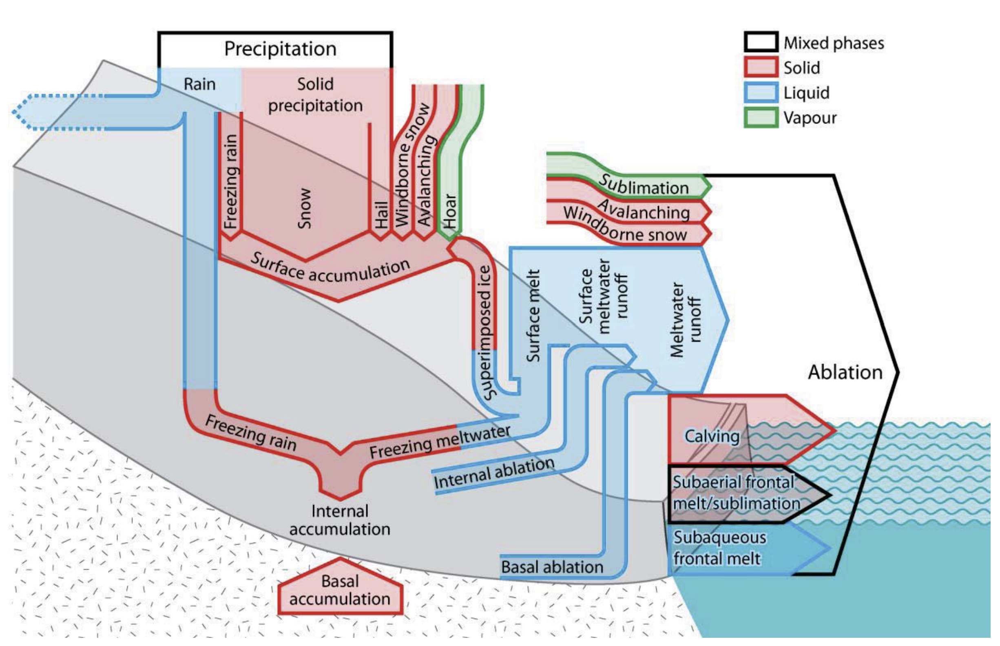
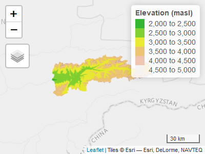
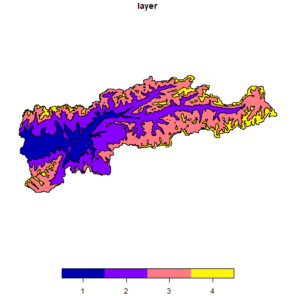
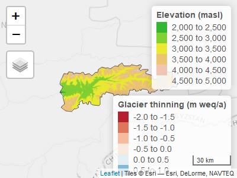
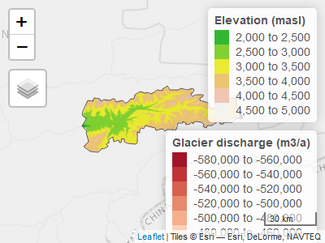

# Background & Motivation

In the Central Asia region, there are key figures to keep in mind in relation to runoff formation: Snow melt is the most important contribution to discharge (\~ 80 %, on average), followed by runoff from liquid precipitation (\~ 17 %, on average) and, finally, glacier melt (\~ 3 %, on average) (personal communication with A. Yakovlev, 2019). @armstrong_runoff_2019 obtain similar orders of magnitude with 65%-75% snow melt, 23% precipitation and 2-8% glacier melt for the basins of the rivers Syr Darya and Amu Darya. In smaller, highly glaciated catchments, the glacier contribution to discharge can be more important [@pohl_glacier_2017; @dhaubanjar_systematic_2021]. The cryosphere is therefore a major contributor to the water balance in Central Asia [@barandun_state_2020]. While glacier runoff is a small contributor to the annual runoff, it is seasonally important as it covers the irrigation demand in summer, when snow melt is over [@kaser_contribution_2010]. Gaining a proper understanding of climate change impacts on the region's hydrology is not just of interest to the scientific community but also of greatest relevance to the local communities and riparian states that depend crucially on the availability of runoff at the right time and location.

Among other things, climate impacts translate into long-term changes of runoff formation fractions and the distribution of runoff formation *within* the hydrological year. Typical rainfall-runoff models such as the HBV Model simulate the fractionation of precipitation into snow and rain with a temperature threshold method. Snow and liquid water reservoirs and corresponding fluxes are then accounted for. However, these models have only a limited understanding of glacier processes which are normally inadequate at best to estimate glacier contributions to discharge. We present a short introduction to glaciers in water resources and a workflow to include state-of-the-art glacier data from the scientific community in day-to-day hydrological modelling.

# Glaciers in Water Resources Modelling

Glaciers consist of compacted snow and frozen water. Many processes contribute to the glacier mass balance (see for example @benn_glaciers_2010 and @cogley_glossary_2011) but we focus on a simplified mass balance as we have data only for accumulated mass balance outcomes (i.e. glacier thinning rates and glacier discharge, see below).

{width="90%"}

Glaciers accumulate mass in the cold period and at higher altitudes through snow fall. Glaciers lose mass to melt driven by the energy balance at the glacier-atmosphere interface [@hock_glacier_2005]. Typically, larger glaciers loose mass at lower altitudes (ablation zone) and accumulate mass at higher altitudes (accumulation zone). The mass loss in the lower altitudes is compensated by the downstream movement of ice from the accumulation zone. The boundary between the accumulation and the ablation zone is called the equilibrium line altitude (ELA).

Naturally, glaciers accumulate mass in the cold season and loose mass to ablation in the warm season. Therefore, the overall mass balance of a glacier should be calculated over a year or, better, over an average of several years.

A simplified multi-year average glacier mass balance, neglecting snow melt, can be expressed as [@braithwaite_sensitivity_2000]:

$$
\Delta S = \text{accumulation} - \text{ablation} \approx P - M
$$

where $\Delta S$ is the change of water storage in the glacier, $P$ is the precipitation over the glacier (assumed to be solid precipitation) and $M$ is glacier melt. If $\Delta S$ is larger than 0 (i.e., $P > M$), the glacier accumulates snow and ice and is growing. If $\Delta S$ is smaller than 0 (i.e., $P < M$), we have *imbalance ablation* and the glacier shrinks.

Glacier melt $M$ can be modeled using full energy balance models or simplifications thereof, e.g. temperature index models [@hock_temperature_2003].

In simplified words, if a glacier, on average, accumulates as much snow as it looses to melt, it is in balance. The average annual glacier discharge is equivalent to the average annual snow fall and called *balance ablation*. The ELA does not move. If the glacier produces more discharge than it accumulates from snow fall, it is not in balance. The ELA moves upwards. The excess melt is called *imbalance ablation*, as also explained in the previous paragraph. If more snow falls that melts, the ELA moves downstream and the glacier grows [@cogley_glossary_2011].

{target="_blank"}.](OGGM_glacier.gif){width="90%"}

Most glaciers worldwide are currently not in equilibrium with the warmer than long-term average climate and thus produce excess melt via imbalance ablation [@hugonnet_accelerated_2021]. In the short term, this is for example good in semi-arid places such as Central Asia where more river discharge is temporarily available in the downstream for irrigation. However, the glaciers produce excess melt only until they reach a new equilibrium at higher altitudes or until they disappear entirely. This means that the excess melt will also disappear and ultimately less water will be available for downstream users during the warm season where glaciers contribute most to runoff. This phenomenon is called peak water [@huss_global-scale_2018].

{width="90%"}

Water resources managers in glaciated catchments are highly interested in knowing when peak water will be reached as measures to adapt for lower water availability need time to implement.

Without in-situ measurements (and actually even with in-situ measurements) it is no easy feat to model the evolution of the water storage in a glacier. The best we can do in water resources modelling is: Use results from existing glacier models and feed them to the water resources model or, alternatively, use the best data available to estimate glacier melt with simple models. As state-of-the-art glacier models are available as open source software [@maussion_open_2019; @rounce_glacier_2020], and even simulation results are published for public use [@rounce_glacier_2020], there is no need to implement an own glacier evolution model. New glacier thickness data sets can be used to update glacier-volume scaling relationships derived for glaciers in Central Asia.

The present vignette gives an overview over the relevant glacier-related data, illustrated using the catchment area of the river Atbashy, a tributary of the Naryn river in Central Asia (status mid 2022).

# Availability on glacier-related data

Recent advances in glacier research yielded a stupendous amount of novel data sets that can be used to map glaciers and to force glacier melt models. The following section gives an overview over the data used in the models, status January 2022.

We use the catchment of the gauging station on the Atabshy river, a tributary to the Naryn river in Central Asia as a demo site. If you'd like to reproduce the examples presented in this vignette you can download the zipped data by clicking this [link](https://www.dropbox.com/sh/r0lqggc77ka0uxd/AAChuIyLHHFIfAdgxNKiU2dpa?dl=1){target="_blank"}. You can extract the the downloaded data into a location of your choice and adapt the reference path in the code chunk below. The rest of the code will run as it is, provided you have the required r packages installed. The size of the data package is approximately 1 GB.


```r
# Install the libraries required to reproduce this vignette
# The below packages are available from cran and can be installed using the 
# command install.packages. Example: install.packages("tmap")
library(tmap)
library(sf)
library(raster)
library(tidyverse)
library(lubridate)

# The package riversCentralAsia is not available from cran. It is installed 
# directly from github via: 
devtools::install_github("hydrosolutions/riversCentralAsia")
# Make sure to update the package from time to time as it is under constant 
# development. 
library(riversCentralAsia)

# Path to the data directory downloaded from the download link provided above. 
# Here the data is extracted to a folder called atbashy_glacier_demo_data
data_path <- "../../atbashy_glacier_demo_data/"
```

## Randolph glacier inventory

The Randolph Glacier Inventory (RGI) v6.0 [@rgi60] makes a consistent global glacier data base publicly available. It includes geo-located glacier geometry and some additional parameters, for example elevation, length, slope and aspect. A new version (v7) is under review at the time of writing mid 2022. For Central Asian water resources modelling, RGI regions 13 (Central Asia) and 14 (South Asia West) are relevant. You can download the glacier geometries for all RGI regions from [the GLIMS RGI v6.0 web site](https://www.glims.org/RGI/rgi60_dl.html){target="_blank"}. For this demo, the data is available from the data download link given above.


```r

dem <- raster(paste0(data_path, "GIS/16076_DEM.tif"))
basin <- st_read(paste0(data_path, "GIS/16076_Basin_outline.shp"), quiet=TRUE)

rgi <- st_read(paste0(data_path, "GIS/16076_Glaciers_per_subbasin.shp"), 
               quiet = TRUE) |> 
  st_transform(crs = crs(dem))

tmap_mode("view")
tm_shape(dem, name = "DEM") +
  tm_raster(n = 6, 
            palette = terrain.colors(6),
            alpha = 0.8,
            legend.show = TRUE, 
            title = "Elevation (masl)") + 
  tm_shape(rgi, name = "RGI v6.0") + 
  tm_polygons(col = "lightgray", lwd = 0.2) + 
  tm_scale_bar(position = c("right", "bottom")) 
```



Note: The python package [rgitools](https://github.com/GLIMS-RGI/rgitools) provides functions pre-processing RGI glacier outlines, such as automated data quality checks or glacier hypsometry data[^1].

[^1]: If you are not familiar with python yet: We recommend the free version of Visual Studio Code, a graphical user interface where you can install support for both python and R code). There is a wealth of resources for beginners to get started, see for example [the python *getting started* site](https://www.python.org/about/gettingstarted/). You can also run python code in RStudio using the [reticulate](https://rstudio.github.io/reticulate/) package

## Glacier thickness

Two global glacier thickness datasets are currently publicly available: @farinotti_consensus_2019_dataset and @milan_ice_2021_dataset.

@farinotti_consensus_2019 make distributed glacier thickness maps available for each glacier in the RGI v6 data set as individual tifs. @millan_ice_2022 provide one tif for each RGI region which is more convenient to handle.


```r
thickness <- raster(paste0(data_path, 
                           "GLACIERS/Milan_glacier_thickness.tif"))

values(thickness)[values(thickness) <= 0] = NA

tmap_mode("view")
tm_shape(dem, name = "DEM") +
  tm_raster(n = 6, 
            palette = terrain.colors(6),
            alpha = 0.8,
            legend.show = TRUE, 
            title = "Elevation (masl)") + 
  tm_shape(thickness, name = "Thickness") + 
  tm_raster(n = 6, 
            palette = "Blues", 
            title = "Thickness [m]") + 
  tm_scale_bar(position = c("right", "bottom")) 
```



## Glacier area-volume scaling

Well-established methods exist to derive the outlines of glaciers from remote sensing data [@rgi60], i.e. the glacier areas are relatively well known (on a global scale). Until recently, glacier volumes have not been available to the wider public and scaling relationships have been used to derive glacier volumes based on glacier area or length, for example [@bahr_physical_1997; @van_de_wal_modelling_2001; @radic_modeling_2006]. And although these scaling relationships have been derived from glaciers presumably in steady-state conditions, @radic_volumearea_2007 have found it to be suitable for long-term glacier development. In Central Asia, the scaling relationship by @erasov_1968 is the most widely applied method, an empirical function of the form:

$$
V = a \cdot A^{b}
$$

With $a=0.027$ and $b=1.5$. Using the RGI v6.0 glacier outlines of region 13 (Central Asia) and the glacier thickness data set by @farinotti_consensus_2019, the volume of each glacier can be estimated and the area-volume scaling by @erasov_1968 can be validated (see [CAHAM book](https://hydrosolutions.github.io/caham_book/glacier_modeling.html#glacier-area-volume-scaling){target="_blank"}). While the relationship derived by Erasov is still valid for glaciers below 20 km2, it may overestimate the glacier volume of larger glaciers. Using the novel data, the parameters of the empirical scaling function derived by @erasov_1968 can be updated to $a=0.0388$ and $b=1.262$ to form what we call the RGIF scaling relationship.

The scaling relationship can be inverted to derive glacier areas based on glacier volumes as:

$$
A=\exp{\left(\frac{\left(\log{V} - \log{a}\right)}{b}\right)}
$$

The package `riversCentralAsia` implements the area-volume scaling and the volume-area scaling with parameter sets from Erasov and derived from @rgi60 and @farinotti_consensus_2019 in the functions `glacierArea_Erasov()`, `glacierArea_RGIF()`, `glacierVolume_Erasov()` and `glacierVolume_RGIF()`.

Further scaling functions to derive glacier area and volume based on glacier length have been published by @aizen_glaciers_2007. These empirical equations have been derived for glaciers in the Tien Shan mountains and are implemented as `glacierAreaVolume_Aizen()` in the riversCentralAsia package. Aizen computes glacier Area $A$ from glacier length $L$ as follows:

$$A=\left(\frac{L}{1.6724}\right)^{\frac{1}{0.561}}$$

And glacier volume $V$ depeding on glacier area:

$$V=0.03782 \cdot A^{1.23}\text{ }\text{ }\text{ for }\text{ }\text{ } A<0.1\text{ km}^2$$

$$V=\frac{\left(0.03332 \cdot A^{1.08} \cdot e^{0.1219 \cdot L}\right)}{L^{0.08846}}\text{ }\text{ }\text{ for }\text{ }\text{ } 0.1 < A < 25\text{ km}^2$$

$$V=0.018484 \cdot A + 0.021875 \cdot A^{1.3521}\text{ }\text{ }\text{ for }\text{ }\text{ } A > 25\text{ km}^2$$

## Glacier runoff

@rounce_glacier_2020 published simulated projections of glacier runoff from till 2100 for the average over the CMIP5 GCM model ensemble[^2] and for all RCPs[^3]. They used the model PyGEM (Python Glacier Evolution Model) which is [available via GitHub](https://github.com/drounce/PyGEM){target="_blank"}. The data can be accessed from @rounce_high_2020.

[^2]: CMIP is the Coupled Model Intercomparison Project which is currently in phase 6 (CMIP 6). The project was initiated in 1995 by the World Climate Research Program and coordinates data sharing and experiments for the comparison of Global Circulation Models (GCM). The models and experiments are basis for the IPCC Assessment Reports.

[^3]: RCP stands for Representative Concentration Pathway and describes global emission scenarios in the CMIP 5 phase. RCPs have been replaced with Shared Socio-economic Pathways (SSP) in the CMIP 6 phase. The SSP are mostly consistent with the RCP.

## Further data that can be used for cross-validation

### Glacier thinning rates

@hugonnet_accelerated_2021 provide annual estimates of glacier thinning rates for each glacier in the RGI v6.0 data set. A copy of the Hugonnet thinning rates is included in the download link above.

The per-glacier time series of thinning rates is available from the [data repository](https://www.sedoo.fr/theia-publication-products/?uuid=c428c5b9-df8f-4f86-9b75-e04c778e29b9){target="_blank"} as described in the [github site](https://github.com/rhugonnet/ww_tvol_study){target="_blank"} linked under the code availability section of the [online paper](https://www.nature.com/articles/s41586-021-03436-z){target="_blank"} of @hugonnet_accelerated_2021.


```r

hugonnet <- read_csv(paste0(data_path, "/GLACIERS/Hugonnet/dh_13_rgi60_pergla_rates.csv"))

# Explanation of variables:
# - dhdt is the elevation change rate in meters per year,
# - dvoldt is the volume change rate in meters cube per year,
# - dmdt is the mass change rate in gigatons per year,
# - dmdtda is the specific-mass change rate in meters water-equivalent per year.

# Filter the basin glaciers from the Hugonnet data set. 
hugonnet <- hugonnet |> 
  dplyr::filter(rgiid %in% rgi$RGIId) |> 
  tidyr::separate(period, c("start", "end"), sep = "_") |> 
  mutate(start = as_date(start, format = "%Y-%m-%d"), 
         end = as_date(end, format = "%Y-%m-%d"), 
         period = round(as.numeric(end - start, units = "days")/366))

# Join the Hugonnet data set to the RGI data set to be able to plot the thinning 
# rates on the glacier geometry. 
glaciers_hugonnet <- rgi |> 
  left_join(hugonnet |> dplyr::select(rgiid, area, start, end, dhdt, err_dhdt, 
                                      dvoldt, err_dvoldt, dmdt, err_dmdt, 
                                      dmdtda, err_dmdtda, period),  
            by = c("RGIId" = "rgiid")) 

tmap_mode("view")
tm_shape(dem, name = "DEM") + 
  tm_raster(n = 6, 
            palette = terrain.colors(6),
            alpha = 0.8, 
            legend.show = TRUE, 
            title = "Elevation (masl)") + 
  tm_shape(glaciers_hugonnet |> dplyr::filter(period == 20), 
           name = "Thinning [m weq/a]") +
  tm_fill(col = "dmdtda", 
          n = 6, 
          palette = "RdBu",
          midpoint = 0, 
          legend.show = TRUE, 
          title = "Glacier thinning\n(m weq/a)") + 
  tm_shape(rgi, name = "RGI v6.0") + 
  tm_borders(col = "gray", lwd = 0.4) + 
  tm_shape(basin, name = "Basin outline") + 
  tm_borders(col = "black", lwd = 0.6) + 
  tm_scale_bar(position = c("right", "bottom"))
```



Glacier thinning rates can be viewed as net glacier mass change or glacier imbalance ablation (if glacier ice deformation processes are neglected).

### Glacier discharge

@miles_health_2021 ran specific mass balance calculations over many glaciers larger than 2 km^2^ of High Mountain Asia. They provide the average glacier discharge between 2000 and 2016. A copy of the glacier discharge data is available from the data download link provided above.

The original data is available from the [data repository](https://zenodo.org/record/5119153#.Yfjv6-rMKF4){target="_blank"} linked in the [online version of the paper](https://www.nature.com/articles/s41467-021-23073-4){target="_blank"}.


```r
 
miles <- read_delim(paste0(data_path,
                           "GLACIERS/Miles/Miles2021_Glaciers_summarytable_20210721.csv"),
                    show_col_types = FALSE, delim = ",") |> 
  dplyr::filter(RGIID %in% rgi$RGIId & VALID == 1)

glaciers_hugonnet <- glaciers_hugonnet |> 
  left_join(miles |> dplyr::select(RGIID, totAbl, totAblsig, imbalAbl, 
                                   imbalAblsig), 
            by = c("RGIId" = "RGIID")) |> 
  mutate(Qgl_m3a = ifelse(is.na(totAbl), NA, totAbl))

tmap_mode("view")
tm_shape(dem, name = "DEM") + 
  tm_raster(n = 6, 
            palette = terrain.colors(6),
            alpha = 0.8, 
            legend.show = TRUE, 
            title = "Elevation (masl)") + 
  tm_shape(glaciers_hugonnet |> dplyr::filter(period == 20), 
           name = "Total ablation [m3/a]") +
  tm_fill(col = "Qgl_m3a", 
          n = 6, 
          palette = "RdBu",
          midpoint = 0, 
          legend.show = TRUE, 
          title = "Glacier discharge\n(m3/a)") + 
  tm_shape(rgi, name = "RGI v6.0") + 
  tm_borders(col = "gray", lwd = 0.4) + 
  tm_shape(basin, name = "Basin outline") + 
  tm_borders(col = "black", lwd = 0.6) + 
  tm_scale_bar(position = c("right", "bottom"))
```



For most hydrological applications, the interest lies on the glacier discharge, i.e. total ablation from glaciers. Despite their large uncertainties, the simulation results by @miles_health_2021 give us an estimate for glacier melt that we can use to calibrate the simpler temperature index models for glacier melt.

## A note on the uncertainties of glacier data sets

The geometries of the RGI v6.0 data set are generally very good. If you simulate glacier discharge in a small catchment with few glaciers it is advisable to visually check the glacier geometries and make sure, all relevant glaciers in the basin are included in the RGI data set. You may have to manually add missing glaciers or correct the geometry.

For some regions in Central Asia, [OpenStreetMap](https://www.openstreetmap.org/#map=6/40.684/66.076){target="_blank"} is an excellent reference for glacier locations and names in Central Asia. You can import the map layer in QGIS or also download individual.

The glacier thickness data set is validated only at few locations as measurements of glacier thickness are typically not available. @millan_ice_2022 report an uncertainty in their ice volume estimations of 39% in RGI regions 13, 14 and 15 (High Mountain Asia).

@hugonnet_accelerated_2021 & @miles_health_2021 provide the uncertainties of their estimates for per-glacier glacier thinning & discharge rates in the data set itself.

# 

# References
