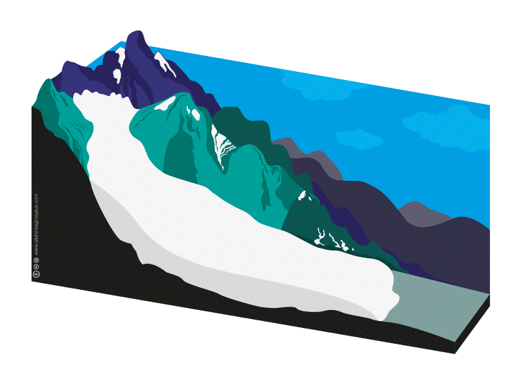

```{r, message=FALSE, warning=FALSE}
library(riversCentralAsia)
library(ggplot2)
library(sf)
library(raster)
library(tidyverse)
```

# Background & Motivation

Melt from glaciers is the most important contributor of discharge in most of the larger rivers in Central Asia. However, measurements of discharge from glaciers are generally not available. There are several possible ways to estimate glacier contribution to discharge. We present a short introduction to glaciers in water resources and a workflow for an empirical method and one via a temperature index model and a simple glacier mass balance.

# Glaciers in water resources modelling

Glaciers consist of compacted snow. Many processes contribute to the glacier mass balance but we focus on a simplified mass balance as we have data only for accumulated mass balance outcomes (i.e. glacier thinning rates and glacier discharge, see below).

Glaciers accumulate mass in the cold period and at higher altitudes through snow fall. Glaciers loose mass to melt caused by radiation. Typically, larger glaciers loose mass at lower altitudes (ablation zone) and accumulate mass at higher altitudes (accumulation zone). The mass loss in the lower altitudes is compensated by the downstream movement of ice from the accumulation zone. The boundary between the accumulation and the ablation zone is called the equilibrium line altitude (ELA).

Naturally, glaciers accumulate mass in the cold season and loose mass to ablation in the warm season. Therefore, overall mass balance of a glacier thus should be calculated over a year or, better, over the average of several years.

A simplified multi-year-average glacier mass balance can be expressed as:

$$
\Delta S = P - M
$$

where $\Delta S$ is the change of water storage in the glacier, $P$ is the precipitation over the glacier (assumed to be solid precipitation) and $M$ is the glacier melt. If $\Delta S$ is larger than 0 ($P>M$), the glacier accumulates solid water and is growing. If $\Delta S$ is smaller than 0 ($P<M$), we have imbalance ablation and the glacier shrinks. Glacier melt $M$ can be modeled using full energy balance models or simplifications thereof, e.g. temperature index models. We'll introduce a temperature index model in (this glaciers vignette)$$glaciers-02-DDMWB.html$$.

If the glaciers on average accumulates as much snow as it looses to melt, it is in balance. The average annual glacier discharge is equivalent to the average annual snow fall and called balance ablation. The ELA does not move. If the glacier produces more discharge than it accumulates from snow fall, it is not in balance. The ELA moves upwards. The excess melt is called imbalance ablation. If more snow falls that melts, the ELA moves downstream and the glacier grows.

{width="90%"}

Most glaciers worldwide are currently not in equilibrium with the warmer than long-term average climate and thus produce excess melt. In the short term, this is good for agriculture as more water is temporarily available for irrigation. However, the glaciers produce excess melt only until they reach a new equilibrium at higher altitudes or until they disappear. This means that the excess melt will also disappear and ultimately less water will be available for downstream users. This phenomenon is called peak water [@huss_global-scale_2018].

{width="90%"}

Water resources managers in glaciated catchments are highly interested in knowing when peak water will be reached as measures to adapt for lower water availability need time to implement.

Without in-situ measurements (and actually even with in-situ measurements) it is no easy feat to model the evolution of the water storage in a glacier. The best we can do in water resources modelling is: Use results from existing glacier models and feed them to the water resources model or use the best data available to estimate glacier melt with simple models.

The following vignettes show:

-   An overview over the available glacier-related data (status early 2022)

-   A method to estimate glacier discharge for a catchment based on a temperature driven degree-day melt function and a simplified glacier mass balance.

The data and methods are illustrated in a sample catchment.

# Availability on glacier-related data

Recent advances in glacier research yielded a stupendous amount of novel data sets that can be used to map glaciers and to force glacier melt models. The following section gives an overview over the data used in the models, status January 2022.

Note: For speed's sake we use a demo data set of the catchment of Atbashy river in the Naryn catchment in Kyrgyzstan. The data is loaded as follows:

```{r, message=FALSE, warning=FALSE}
data("vignette_glacier_melt")

# Also load the digital elevation model (DEM) of the catchment for 
# visualization.
dem_df <- as.data.frame(as(dem, "SpatialPixelsDataFrame"))
colnames(dem_df) <- c("Elevation\n[masl]", "x", "y")
```

## Randolph glacier inventory

The Randolph glacier inventory (RGI) v6.0 [@rgi60] makes a consistent glacier data base publicly available. It includes geo-located glacier geometry and some additional parameters like elevation, length, slope and aspect. A new version (v7) is under review at the time of writing. For Central Asian water resources modelling, RGI regions 13 (Central Asia) and 14 (South Asia West) are relevant. You can download the data from [the GLIMS RGI v6.0 web site](https://www.glims.org/RGI/rgi60_dl.html).

```{r rgi, message=FALSE, warning=FALSE}
#| fig.cap = "DEM & Glaciers of the demo basin." 
#| out.width = 90%
ggplot(rgi) + 
  geom_raster(data = dem_df, aes(x, y, fill = `Elevation\n[masl]`), 
              alpha = 0.6) + 
  geom_sf(aes(fill = NULL), colour = "lightgray", size = 0.2) + 
  scale_fill_gradientn(colours = terrain.colors(100), ) + 
  xlab("Longitude") + 
  ylab("Latitude") + 
  theme_bw()
```

## Glacier thickness

@farinotti_consensus_2019 make distributed glacier thickness maps available for each glacier in the RGI v6 data set. We have generated a mosaic of the glacier thickness tifs for you. We will refer to this data set as the glacier thickness data set or the Farinotti data set.

If you are interested to replicate the download and pre-processing please read the section below. The glacier thickness data set is available from the [data collection](https://www.research-collection.ethz.ch/handle/20.500.11850/315707) of @farinotti_consensus_2019 which is available from [the data section of their online article](https://www.nature.com/articles/s41561-019-0300-3). You can download the glacier thickness composites for the relevant RGI v6.0 regions 13 and 14. In the unzipped directories you will find individual tif files for each glacier. The following section demonstrates how to extract glacier thickness data from the Farinotti data set.

### How to extract glacier thickness

```{r thicknessExtraction, eval=FALSE, message=FALSE, warning=FALSE}
# Get a list of all files in the glacier thickness data set. The files are named 
# after the glacier ID in the RGI v6.0 data set (variable RGIId).  
glacier_thickness_dir <- "<Path to glacier thickness tif files (unzipped)>" 

filelist <- list.files(path = glacier_thickness_dir, pattern = ".tif$", 
                       full.names = TRUE)

# Filter the glacier thickness file list for the glacier ids in the catchment of 
# interest. 
filelist <- filelist[sapply(rgi$RGIId, grep, filelist)]

# Get the maximum glacier thickness for each of the glaciers in filelist. 
# Note: this works only for small catchments as the origin of the rasters to be 
# mosaiced needs to be consistent. For a larger data set you will need to implement 
# a loop over all glaciers to extract the thickness per glacier or per elevation 
# band. 
glacier_thickness <- Reduce(function(x, y) raster::mosaic(x, y, fun = max),
                            lapply(filelist, raster::raster))

# For plotting, clip the glacier thickness raster of the basin to the basin boundary
glacier_thickness <- mask(glacier_thickness, shp_koksu_shait_outline)
```

```{r thickness, message=FALSE, warning=FALSE}
#| fig.cap = "Glacier thickness by Farinotti et al., 2019" 
#| out.width = 90%
glacier_thickness_df <- as.data.frame(as(glacier_thickness, 
                                         "SpatialPixelsDataFrame")) 
colnames(glacier_thickness_df) <- c("Thickness\n[m weq]", "x", "y")

# Filter for glacier thickness larger than 0
glacier_thickness_df <- glacier_thickness_df |> 
  dplyr::filter(`Thickness\n[m weq]` > 0)

ggplot() + 
  geom_tile(data = glacier_thickness_df, 
            aes(x, y, fill = `Thickness\n[m weq]`)) + 
  geom_sf(data = basin, fill = NA, colour = "black") + 
  xlim(c(1180000, 1196888)) +  
  ylim(c(4590000, 4610000)) + 
  labs(x = "Longitude", y = "Latitude") + 
  theme_bw()
```

## Glacier thinning rates

@hugonnet_accelerated_2021 provide annual estimates of glacier thinning rates for each glacier in the RGI v6.0 data set. It is advised to not use the annual data though but an average over at least 5 years to get reliable thinning rates. We will refer to this data set as the thinning rates data set or the Hugonnet data set.

The glacier thinning rates can be downloaded from the [data repository](https://www.sedoo.fr/theia-publication-products/?uuid=c428c5b9-df8f-4f86-9b75-e04c778e29b9) as described in the [github site](https://github.com/rhugonnet/ww_tvol_study) linked under the code availability section of the [online paper](https://www.nature.com/articles/s41586-021-03436-z) of @hugonnet_accelerated_2021. We use the per-glacier time series.

```{r thinning, message=FALSE, warning=FALSE}
#| fig.cap = "Average glacier mass change by Hugonnet et al., 2021."
#| out.width = 90%
temp <- glaciers_hugonnet |> 
         dplyr::filter(period == 20, start == "2000-01-01")
temp_coord <- as_tibble(st_coordinates(st_centroid(temp)))
ggplot(temp) + 
  geom_sf(aes(fill = dmdtda), colour = NA) + 
  scale_fill_viridis_c() + 
  labs(x = "Longitude", y = "Latitude", fill = "imbal. abl.\n[m we/a]") + 
  xlim(c(1180000, 1196888)) +  
  ylim(c(4590000, 4610000)) + 
  theme_bw()
```

## Glacier discharge

@miles_health_2021 ran specific mass balance calculations over the glaciers larger than 2 km2 of High Mountain Asia. They provide the average glacier discharge between 2000 and 2016. We have derived an empirical relationship to derive glacier discharge based on glacier thinning rates which is available in the function \code{riversCentralAsia::glacierDischarge_HM()}. We will refer to this data set as the glacier discharge data set or the Miles data set.

The data is available from the [data repository](https://zenodo.org/record/5119153#.Yfjv6-rMKF4) linked in the [online version of the paper](https://www.nature.com/articles/s41467-021-23073-4).

```{r glacierDischarge, message=FALSE, warning=FALSE}
#| fig.cap = "Glacier discharge derived from Miles et al., 2021."
#| out.width = 90%
# Calculate glacier discharge using the glacierDischarge_HM function of the 
# riversCentralAsia package. An empirical relationship between glacier thinning 
# rates by Hugonnet et al., 2021 and glacier discharge by Miles et al., 2021.  
glaciers_hugonnet <- glaciers_hugonnet |> 
  mutate(Qgl_m3a = glacierDischarge_HM(dhdt))
temp <- glaciers_hugonnet |> 
         dplyr::filter(period == 20, start == "2000-01-01")
temp_coord <- as_tibble(st_coordinates(st_centroid(temp)))
ggplot(temp) + 
  geom_sf(aes(fill = Qgl_m3a*10^(-6)), colour = NA) + 
  scale_fill_viridis_c() + 
  labs(x = "Longitude", y = "Latitude", fill = "Qgl\n[10^6 m3/a]") + 
  xlim(c(1180000, 1196888)) +  
  ylim(c(4590000, 4610000)) + 
  theme_bw()
```

## A note on the uncertainties of glacier data sets

The geometries of the RGI v6.0 data set are generally very good. If you simulate glacier discharge in a small catchment with few glaciers it is advisable to visually check the glacier geometries and make sure, all relevant glaciers in the basin are included in the RGI data set. You may have to manually add missing glaciers or correct the geometry.

For some regions in Central Asia, [OpenStreetMap](https://www.openstreetmap.org/#map=6/40.684/66.076) is an excellent reference for glacier locations and names in Central Asia. You can import the map layer in QGIS or also download individual.

The glacier thickness data set is validated only at few locations as measurements of glacier thickness are typically not available. Uncertainties of up to p/m 50% have to be taken into account according to @farinotti_consensus_2019.

@hugonnet_accelerated_2021 & @miles_health_2021 provide the uncertainties of their estimates for per-glacier glacier thinning & discharge rates in the data set itself.

# References
