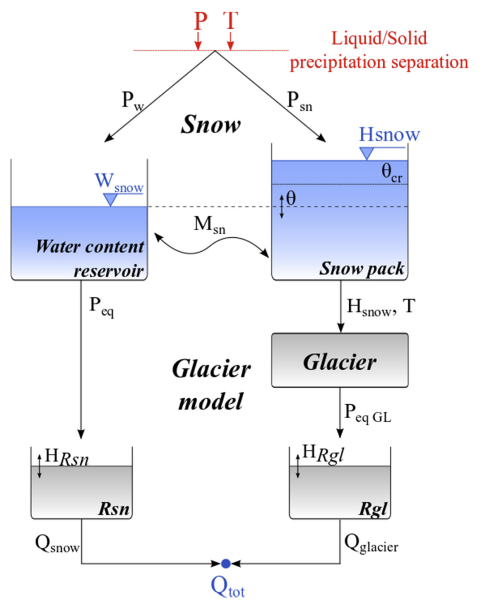

```{r, message=FALSE, warning=FALSE}
library(riversCentralAsia)
library(tidyverse)
library(sf)
```

# Glacier modelling tools in RS Minerve

At the time of writing (Feb 2022), RS Minerve features one model to simulate glacier discharge, the GSM model [@rsminerve_tm]. The GSM model is able to accumulate solid precipitation on a glacier water reservoir and to melt that reservoir depending on temperature. It is a suitable temperature index model for short-term glacier melt where changes in glacier area can be neglected.

{width="60%"}

As implied above, the GSM model in RSM assumes a constant glacier area. It is thus not suitable for long-term simulations of glacier melt, especially under climate change scenarios where glacier area changes are important. In other words, the GSM model cannot predict when a glacier reservoir has disappeared.

In practice, two pathways are possible to handle the weakness of the model when simulating climate change impacts:

-   The modeler periodically stops the simulation and checks which glaciers have disappeared, then manually adapts the model parameters.

-   The glacier melt is simulated outside RS Minerve and subsequently introduced to RS Minerve as a water source.

The first approach is suitable for one-time simulations but it is labor intensive and thus hardly scalable. It further does not solve the problem that the glacier area remains constant in the model. The latter approach requires the separation of seasonal glacier discharge under balance conditions (i.e. the seasonal glacier melt which is compensated by accumulation of snow in winter) and the imbalance ablation which represent glacier melt due to rising temperatures.

Here, we present the second approach. [Vignette 2 on the glacier mass balance modelling](glaciers-02-DDMWB.html) demonstrates how to calculate total annual glacier discharge and the contribution of imbalance ablation to the total annual glacier discharge. This vignette demonstrates how to derive daily glacier discharge and imbalance ablation time series from the annual data and how to include this data in RS Minerve.

# From annual to daily melt

The glacier mass balance is done on a yearly basis (if not at lower frequency). Hydrological models, however, typically run at higher frequency, for example monthly or daily time steps. One simple method to distribute glacier discharge on a year is to scale it according to the daily melt computed.

```{r imbalabl, message=FALSE, warning=FALSE}
#| fig.cap = "Glacier discharge from imbalance ablation. " 
#| out.width = 90%
# Read in the daily glacier melt and the annual glacier discharge and imbalance 
# ablation computed in glacier vignette 2. 
melt_mmd <- readRDS("daily_glacier_melt.rds")
glacier_balance <- readRDS("glacier_balance.rds")

# Compute the annual glacier melt
melt_mma <- melt_mmd |> 
  mutate(Hyear = hyear(date)) |> 
  group_by(Hyear, RGIId) |> 
  summarise(M_mma = sum(M_mmd)) |> 
  ungroup()

imbalAbl_m3s <- melt_mmd |> 
  mutate(Hyear = hyear(date)) |> 
  left_join(melt_mma, by = c("RGIId", "Hyear")) |> 
  left_join(glacier_balance |> 
              dplyr::filter(Variable == "Qimb_m3a") |> 
              transmute(Hyear = Hyear, 
                        RGIId = RGIId, 
                        Qimba_m3s = -1* Value/(60*60*24*365)) |> 
              mutate(Qimba_m3s = ifelse(Qimba_m3s < 0, 0, Qimba_m3s)), 
            by = c("RGIId", "Hyear")) |> 
  mutate(Qimb_m3s = Qimba_m3s * (M_mmd/M_mma), 
         Qimb_m3s = ifelse(is.na(Qimb_m3s), 0, Qimb_m3s))

ggplot(imbalAbl_m3s |> 
         dplyr::filter(RGIId %in% unique(glacier_balance$RGIId)[1:7])) + 
  geom_line(aes(date, Qimb_m3s, colour = RGIId)) + 
  scale_colour_viridis_d() + 
  labs(x = "Date", y = "Glacier discharge from imbalance ablation [m3/s]") + 
  theme_bw()
```

# Aggregation to sub-basins

You don't need to implement a source for each glacier in RS Minerve. You can aggregate the imbalance ablation by sub-basins and save you some work implementing the sources in RS Minerve. What you will need is a shape file telling you in which sub-basin each glacier lies. This GIS layer needs to be prepared manually in QGIS because typically, the RGI v6.0 glacier outlines are not consistent with the river basin boundaries derived from SRTM. In QGIS you intersect the sub-basin layer with the RGI layer and manually adapt the boundaries between the sub-basins to be consistent with the glacier outlines. This step is important as you will double count any glaciers which are cut by sub-basin boundaries and thus are present in two different sub-basins.

We have prepared this for you and already intersected the sub-basin boundary object with the glacier outlines.

```{r glaciersbysubbasin, message=FALSE, warning=FALSE}
#| fig.cap = "Glaciers coloured by sub-basin." 
#| out.width = 90%
data <- vignette_glacier_melt

ggplot(data$rgi |> mutate("Sub-basin" = gsub("_Subbasin", "", name_2))) + 
  geom_sf(data = data$basin, fill = NA, colour = "black") + 
  geom_sf(aes(fill = `Sub-basin`, colour = `Sub-basin`)) +
  scale_fill_viridis_d() + 
  scale_colour_viridis_d() + 
  theme_bw()
```

```{r imbalAblSubbasin, message=FALSE, warning=FALSE}
#| fig.cap = "Glacier discharge from imbalance ablation aggregated to sub-basins. " 
#| out.width = 90%
Qimb_m3s_sub <- imbalAbl_m3s |>
  dplyr::select(RGIId, date, Qimb_m3s) |>
  left_join(data$rgi |> 
              st_drop_geometry() |>
              dplyr::select(RGIId, name_2)) |>
  group_by(date, name_2) |>
  summarise(Qimb_m3s = sum(Qimb_m3s, na.rm = TRUE)) |>
  ungroup() 

ggplot(Qimb_m3s_sub |> 
         mutate("Sub-basin" = gsub("_Subbasin", "", name_2))) + 
  geom_line(aes(date, Qimb_m3s, colour = `Sub-basin`), alpha = 0.8) + 
  scale_colour_viridis_d() + 
  labs(x = "Date", y = "Glacier discharge from imbalance ablation [m3/s]") + 
  theme_bw()
```

# Writing input file for RS Minerve

The input file format for RS Minerve is described in @rsminerve_tm, page 136.

```{r writingRSMinput, eval=FALSE}
Q <- Qimb_m3s_sub |>
  mutate(Qimb_m3s = round(Qimb_m3s, digits = 7))

temp_wide <- Q |>
  pivot_wider(names_from = name_2, values_from = Qimb_m3s) |> 
  rename(Station = date) 

datechar <- posixct2rsminerveChar(temp_wide$Station)$value
datechar <- gsub(" 01:00:00", " 00:00:00", datechar)
datechar <- gsub(" 02:00:00", " 00:00:00", datechar)
output <- rbind(colnames(temp_wide),
                c("X", "1", "1", "1", "1"), 
                c("Y", "2", "2", "2", "3"), 
                c("Z", "3", "3", "3", "3"), 
                c("Sensor", "Q", "Q", "Q", "Q"), 
                c("Category", "Flow", "Flow", "Flow", "Flow"), 
                c("Unit", "m3/s", "m3/s", "m3/s", "m3/s"), 
                c("Interpolation", "Linear", "Linear", "Linear", 
                  "Linear"), 
                cbind(datechar, 
                      as.character(temp_wide$Dzhaldzhur_Subbasin), 
                      as.character(temp_wide$Ulak_Subbasin), 
                      as.character(temp_wide$Atbaschy_Midstream_Subbasin), 
                      as.character(temp_wide$Atbaschy_Downstream_Subbasin)))

writefilename <- "~/../Documents/RSM_demo_glacier_source.csv"
write.table(output, file = writefilename, col.names = FALSE, 
            row.names = FALSE, append = FALSE, quote = FALSE, 
            sep = ",", dec = ".")
```

# References
